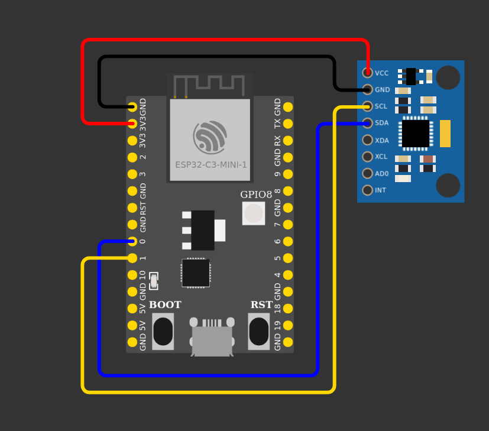
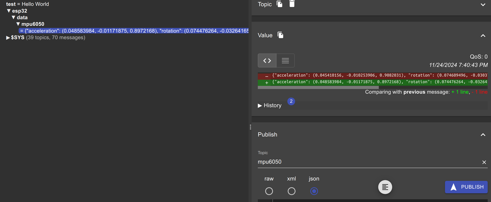

# MQTT Client with MPU6050 Sensor

This project demonstrates how to read data from an MPU6050 sensor, create a JSON object, and send it via MQTT using an ESP32 microcontroller. The project also includes a NeoPixel for visual feedback.

## Features

- Initialize and configure WiFi
- Initialize and configure I2C and MPU6050 sensor
- Read acceleration, gyroscope, angles, and temperature data from MPU6050
- Create a JSON object from the sensor data
- Publish the JSON data to an MQTT broker
- Use NeoPixel for visual feedback

## Requirements

- ESP32 C3
- MPU6050 sensor
- MQTT broker
- Rust toolchain
- ESP-IDF

## Results

